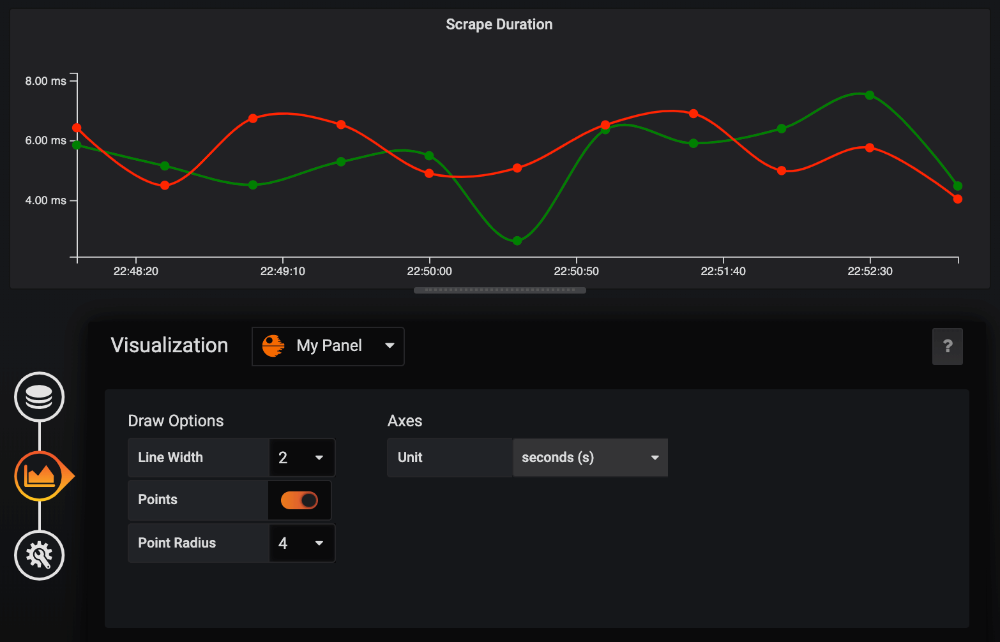

## My Simple Panel

A simple panel plugin to demo how to make a grafana panel plugin.

- [Step by step tutorial](./notes/how-make-a-grafana-panel-plugin.md)

Final effect:



[Demo Video](https://youtu.be/kJsZy8M5eNU)

### Building this plugin

This plugin leverages the grafana-toolkit to simplify building and packaging a plugin.

Install Module Dependencies

```BASH
yarn
```

Build plugin in production mode

```BASH
yarn build
```

Build plugin in development mode

```BASH
yarn dev
```

Build plugin in development mode, watching for changes.

```BASH
yarn run watch
```
